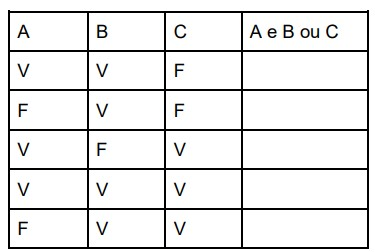
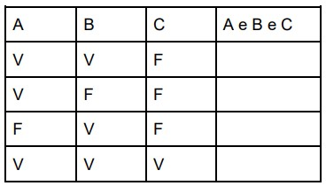
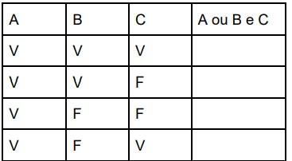

# Exercícios Aula 4 - Operadores, Tabela Verdade e Variáveis

<html>
  
<strong>1- Analise os algoritmos abaixo e apresente os resultados das linhas ESCREVA :</strong>  
  a) X = 15 
  Y = 20 
  ESCREVA X 
  B = 3 
  ESCREVA X, Y  
  b) A = 15 
  B = 3 
  C = A * B 
  ESCREVA C 
  B = 10 
  C = A - B 
  ESCREVA A, B, C  
  c) X = 10 
  Y = 12 
  Z = X 
  Y = Z 
  X = Y 
  ESCREVA X, Y, Z  
  d) A = 10 
  B = A + 2 
  A = B + 1 
  B = A + 1 
  ESCREVA A 
  A = B + 1 
  ESCREVA A, B  
  e) X = 12 
  Y = X 
  Z = X + Y 
  X = 20 
  Y = 10 
  ESCREVA X, Y, Z  
  f) A = 2 
  B = 3 
  A = A + B 
  C = A - B 
  ESCREVA C 
  B = 5 
  ESCREVA A, B, C

  
<strong>2 - Baseado nos conceitos de tabela verdade e operadores, quais são os resultados (V ou F) de A, B, C, D:</strong>  
  A = 10/2 + 12/3 > (4+5+2) * 2 
  B = (4/(2+2) + 5 <= 10) E (A) 
  C = ((4+2) * 2 = 8) OU (B) 
  D = (A) OU (B) E ©

  
<strong>3 - Baseado nos conceitos de tabela verdade, resolva:</strong>  

  a)
  
  b)
  
c)
  
  
<strong>4 - Para A = V, B = V e C = F, qual o resultado da avaliação das seguintes expressões:</strong>  
  a) (A e B) ou (A ou B) 
  b) (A ou B) e (A e C) 
  c) A ou C e B ou A e não B

